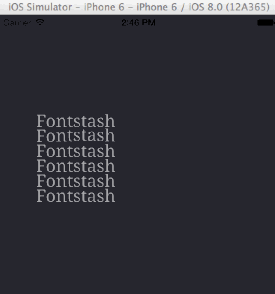

fontstash-es
============

This project is based on [fontstash](https://github.com/memononen/fontstash), it is using OpenGL ES 2.0 in order to be used on mobile devices. 

You can use the following features:

+ Text-shaping using the [Harfbuzz](https://github.com/behdad/harfbuzz) text-shaping engine: this lets you render text in several directions (left-to-right, top-to-bottom...), compatible only by using the FreeType rasterizer.
+ Signed distance field rendering: to draw outlines on the fly on GPU.

Activating features
-------------------

Enabling text-shaping using the freetype rasterizer:
```c++
#define FONS_USE_FREETYPE
#define GLFONTSTASH_IMPLEMENTATION
#define FONS_USE_HARFBUZZ
#import "glfontstash.h"
```

Usage
-------------

Every `fons*` functions is relative to the initial fontstash implementation, see https://github.com/memononen/fontstash for more details about it. 

Every `glfons*` concern the rendering backend and will modify the way text is rendered.

**Creating a context**

First create a context calling `glfonsCreate`:
```c++
FONScontext* context = glfonsCreate(512, 512, FONS_ZERO_TOPLEFT);
```
This will create a 512*512 2d texture-atlas where glyphs would be stored.
The atlas could become full, if you want to do anything concerning this you can plug your error callback using `fonsSetErrorCallback` and handle errors like [here](https://github.com/tangrams/ofxVectorTile/blob/master/libs/glmFontstash/glmFont.cpp#L61_L77) for example. 

Then add **.ttf** font files to your context using `fonsAddFont`.

**Drawing text**

After creating a context you can send data to the GPU, to do so, use the `glfonsBufferText` function. 
```c++
glfonsBufferText(context, "fontstash-es", &textId, FONS_EFFECT_NONE);
```
This call has to be done only once, then use the identifier in your main rendering loop like this:
```c++
glfonsDrawText(context, textId);
```

**Transforming text**

To transform text you can use the following function:

```c++
void glfonsTransform(FONScontext* ctx, fsuint id, float tx, float ty, float r, float a);
```

Where tx and ty are the translations in pixel in screen space, r the rotation in radians. 
Alpha could also be given here since it's stored in the same memory location as transforms.



**Using the text-shaping engine**

This feature has to be enabled before buffering the text you want to shape.

Example of shaping arabic text in a *right-to-left* way and chinese in a *top-to-bottom* way:

```c++
fonsSetShaping(fs, "arabic", "RTL", "ar");
glfonsBufferText(fs, "سنالى ما شاسعة وق", &textar1, FONS_EFFECT_NONE);
fonsSetShaping(fs, "han", "TTB", "ch");
glfonsBufferText(fs, "緳 踥踕", &textch1, FONS_EFFECT_NONE);
```

**Using signed distance field to draw outlines**

This feature has to be enabled before buffering the text you want to shape. 

```c++
fonsSetBlur(fs, 8.0); // sets the blur used in the distance field computation
fonsSetBlurType(fs, FONS_EFFECT_DISTANCE_FIELD);
glfonsBufferText(fs, "fontstash-es", &textId, FONS_EFFECT_DISTANCE_FIELD);
```

Then use this in your main rendering loop in order to update the signed distance field rendering:

```c++
void glfonsSetSDFProperties(FONScontext* ctx, float minOutlineD, float maxOutlineD, float minInsideD, float maxInsideD, float mixFactor);
```

Note that using outlines on scripts having high typographic ligatures gives unexpected results for now.

Adding fontstash-es to your project
-----------------------------------

The text-shaping feature creates a lot of dependencies and uses some static libraries in order to be used. 

If you're not planning to use the text-shaping engine, simply add the fontstash-es/glm headers in your project (the glm dependency should be removed anytime soon). 

If you want to use the text-shaping engine you would need the header files from harfbuzz, freetype2 and the static libraries for these two + [ucdn](https://github.com/grigorig/ucdn) for unicode database and normalization; this for each of the different architectures you would be targetting. This project has these static libraries only for the iPhone simulator architecture (i386, x86_64).
